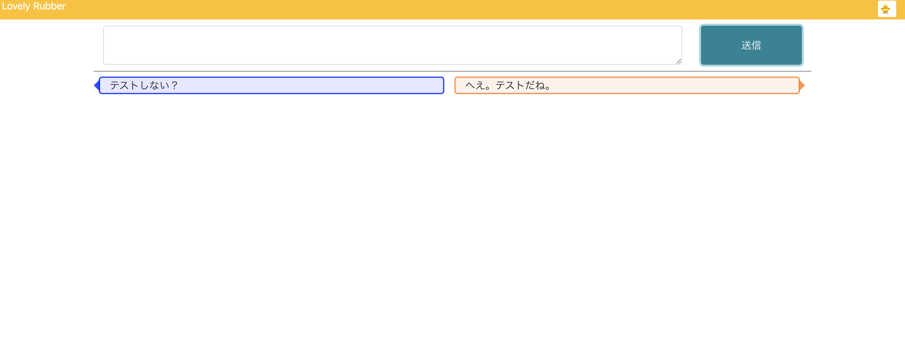

# LovelyRubber

> My Rubberducking App

[https://mi-ki-ri.github.io/lovely-rubber/](https://mi-ki-ri.github.io/lovely-rubber/)

## RubberDucking?

ゴム製のアヒルの人形と会話することで頭の中を整理するテクニックです。

それをWebアプリにしたものがLovelyRubberになります。

## How To Use

画面上部のテキストエリアに話したいことを入れ、Submitボタンで送信します。

AIが **適当** に返事をしてくれるので、さらに会話を続けます。

## Special Thanks

- [COTOHA API](https://api.ce-cotoha.com/contents/index.html)
    - キーワード抽出に使用
- Nuxt.js
- Bootstrap Vue
- axios